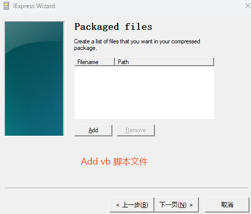
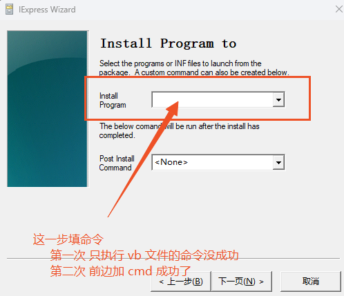

# 打包 exe
## 打包些小脚本来提高效率
双击直接打开项目目录，免去 cd ...

```vbscript
Set WshShell = CreateObject("WScript.Shell")

' 设置 Git Bash 路径（默认安装路径）
gitBashPath = """C:\Program Files\Git\bin\bash.exe"" --login -i"

' 设置要进入的目标目录（例如 D:\projects\myrepo）
targetDir = "D:\project"

' 组合命令，在 Git Bash 中打开并切换到目标目录
command = "cd " & targetDir & " && exec bash"

' 启动 Git Bash 并执行命令
WshShell.Run gitBashPath & " -c """ & command & """", 1, False

```
保存到 xx.vbs，**脚本可以直接双击执行**，但是不能放到开始菜单。如果想放到开始菜单，需要打包成 exe 文件。

## 用 Win 自带的 iexpress 打包成 exe 文件
- win + r 打开 cmd，输入 iexpress 回车  
- 记录两步，参考图：  

  
命令（第二个版本的命令可用，第一个没成功）：
```
C:\Windows\System32\wscript.exe "D:\自定义操作\Git\Git.vbs"

```
```
cmd.exe /c "C:\Windows\System32\wscript.exe D:\自定义操作\Git\Git.vbs"

```
其他照着执行就 OK，打包后就成了 exe 文件，可以放到开始菜单