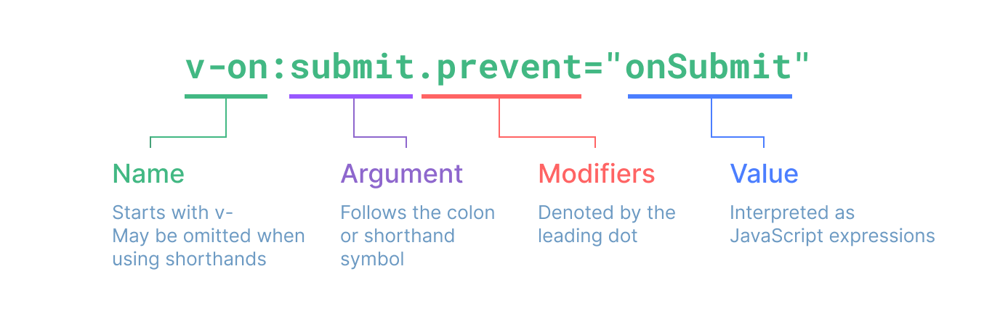

# directive
## 指令语法图


## 函数式风格
``` js
bind('click', handleClick, { stop: true, prevent: true });
```
## 路径式命名
```html
<div @on:click.stop.prevent="handleClick"></div>
```
## 指令的前世今生
### jQuery 时代
### AngularJS 指令

## 对象写法和路径式命名的取舍，是否考虑 JSX？