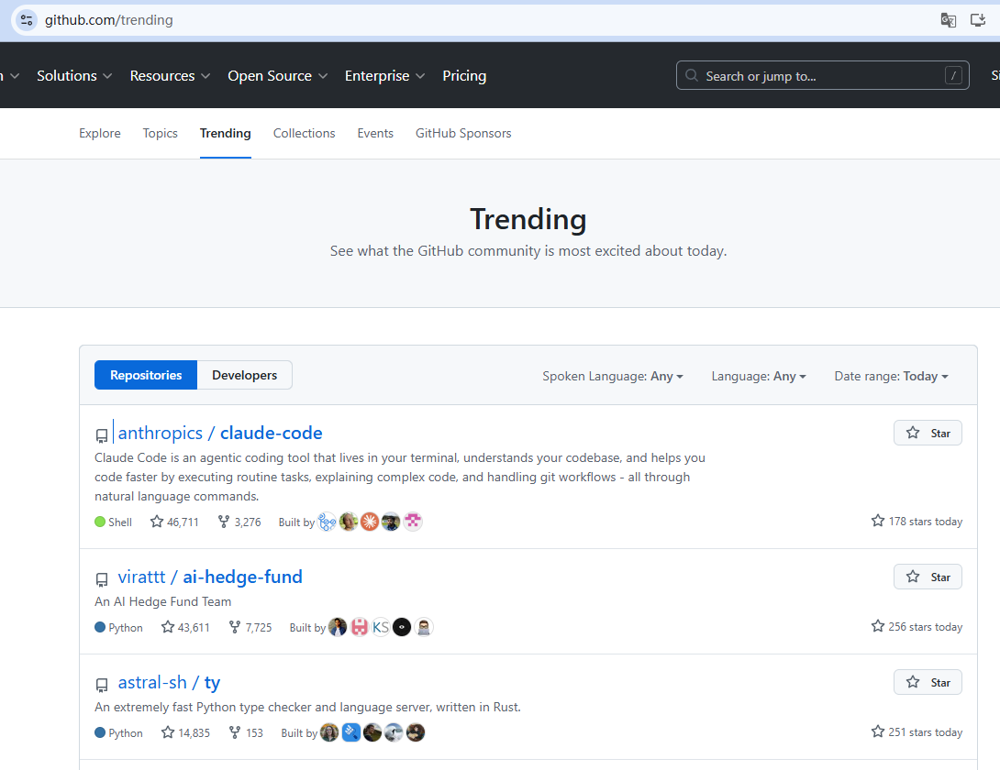

# 如何使用 GitHub

## 思路：
GitHub 不简单是“代码仓库网站”，是：

技术趋势雷达 + 工程样本库 + 轮子博物馆 + 开源社交场

- 新兴项目：
Star 不多 + 增长快
## 趋势
### GitHub Trending
链接：https://github.com/trending

参考截图：

#### Daily / Weekly
- 查看
  - 看项目一句话
  - 看它解决什么“麻烦”
  - 看它是不是“替代某个老东西”

- 重点关注（适合跟进）：
  - Star：几百 ~ 两三千
  - 创建时间：1 年内
  - 最近更新：几天内

#### Trending 反向学习
不是问「我要学什么」，而是：

现在工程师在为什么问题疯狂点 Star？

比如发现：
- 一堆 AI Wrapper
- 一堆 Dev Tool
- 一堆 CLI / 本地工具
- 一堆“把复杂东西变简单”的项目

这就是 造轮子的方向提示

## 找项目

