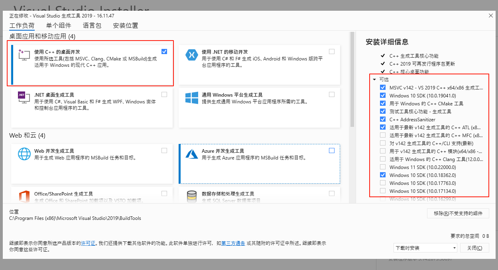

# node-sass 处理


## 遇到的问题：
### node-sass 这个包需要 node-gyp 这个包去 rebuild
- 关键词： 
    - **node-gyp@7.1.2**  
    - **Visual Studio version 2022**
    - **Visual Studio version 2019**
- 关键句子：
    - gyp ERR! find VS unknown version "undefined" found at "C:\Program Files (x86)\Microsoft Visual Studio\2022\BuildTools"

相关报错摘要：
```
npx node-gyp rebuild --msvs_version=2019
gyp info it worked if it ends with ok
gyp info using node-gyp@7.1.2
gyp info using node@16.15.0 | win32 | x64
gyp info find Python using Python version 3.10.9 found at "D:\codeTools\python\python.exe"
gyp ERR! find VS
gyp ERR! find VS msvs_version was set from command line or npm config
gyp ERR! find VS - looking for Visual Studio version 2022
gyp ERR! find VS running in VS Command Prompt, installation path is:
gyp ERR! find VS "C:\Program Files (x85)\Microsoft Visual Studio\2021\BuildTools"
gyp ERR! find VS - will only use this version
gyp ERR! find VS unknown version "undefined" found at "C:\Program Files (x86)\Microsoft Visual Studio\2022\BuildTools"
gyp ERR! find VS could not find a version of Visual Studio 2017 or newer to use
gyp ERR! find VS looking for Visual Studio 2015
gyp ERR! find VS - not found
gyp ERR! find VS not looking for VS2013 as it is only supported up to Node.js 8
gyp ERR! find VS msvs_version does not match this VS Command Prompt or the
gyp ERR! find VS installation cannot be used.
gyp ERR! find VS
gyp ERR! find VS **************************************************************
gyp ERR! find VS You need to install the latest version of Visual Studio
gyp ERR! find VS including the "Desktop development with C++" workload.
gyp ERR! find VS For more information consult the documentation at:
gyp ERR! find VS https://github.com/nodejs/node-gyp#on-windows
gyp ERR! find VS **************************************************************
gyp ERR! find VS
gyp ERR! configure error
gyp ERR! stack Error: Could not find any Visual Studio installation to use
gyp ERR! stack     at VisualStudioFinder.fail (E:\NyxAtWork\ac-b-office\node_modules\node-gyp\lib\find-visualstudio.js:121:47)
gyp ERR! stack     at E:\NyxAtWork\ac-b-office\node_modules\node-gyp\lib\find-visualstudio.js:74:16
gyp ERR! stack     at VisualStudioFinder.findVisualStudio2013 (E:\NyxAtWork\ac-b-office\node_modules\node-gyp\lib\find-visualstudio.js:351:14)
gyp ERR! stack     at E:\NyxAtWork\ac-b-office\node_modules\node-gyp\lib\find-visualstudio.js:70:14
gyp ERR! stack     at E:\NyxAtWork\ac-b-office\node_modules\node-gyp\lib\find-visualstudio.js:372:16
gyp ERR! stack     at E:\NyxAtWork\ac-b-office\node_modules\node-gyp\lib\util.js:54:7
gyp ERR! stack     at E:\NyxAtWork\ac-b-office\node_modules\node-gyp\lib\util.js:33:16
gyp ERR! stack     at ChildProcess.exithandler (node:child_process:406:5)
gyp ERR! stack     at ChildProcess.emit (node:events:527:28)
gyp ERR! stack     at maybeClose (node:internal/child_process:1092:16)
gyp ERR! System Windows_NT 10.0.26100
gyp ERR! command "D:\\codeTools\\nodejs\\node.exe" "E:\\NyxAtWork\\ac-b-office\\node_modules\\node-gyp\\bin\\node-gyp.js" "rebuild" "--msvs_version=2019"
gyp ERR! cwd E:\NyxAtWork\ac-b-office
gyp ERR! node -v v16.15.0
gyp ERR! node-gyp -v v7.1.2
gyp ERR! not ok
```

摘要解读：  
因为 node-gyp 原因，
gyp info using node-gyp@7.1.2 需要 vs c++ 2019 版本， 2022版本会输出 版本号 undefined ，并不能兼容。

visualstudio 安装勾选：  
- 使用 C++ 桌面开发 
- Windows 10 SDK（10.0.xxxx）  
参考截图：


参考编译命令：
```
# 两行
npx node-gyp configure
npx node-gyp build

# 或执行下面一行 
npx node-gyp rebuild
```

另外，  
python 3.13 也不不一定支持， 要下载 python 3.10 版本 

解决过程中的其他问题：  
- python 卸载的坑  

    > 报错关键词：“could not set file security for file 'D:\Config.Msi\xxx

    卸载过程中 弹窗 没权限卸载 xxxx 文件，python 中也找不到 卸载的程序，无法右键 管理员启动 卸载程序（win11 控制面板也不能管理员运行）  

    解决方案：  
    此时 可以通过任务管理器 查找文件位置（要再控制面板运行卸载python的程序），找到后这个文件后（关掉正在卸不掉的卸载程序），然后 可以 右键 管理员方式运行找到的 卸载程序，就可以卸载 python 了（控制面板那里找不到管理员启动，win11版本。这个也很坑）

其它方向：
我用 sass 替换过 node-sass ，但是有些不兼容，编译 代码的时候有 sass 语法报错，不敢趟这个水。但如果走这个方向，应该也可以了。毕竟最多编译sass 出点问题，不会影响逻辑代码。sass 毕竟是 静态编译后 在使用的 css 。

参考链接：  
- visualstudio 2019 安装包链接：https://visualstudio.microsoft.com/vs/older-downloads/