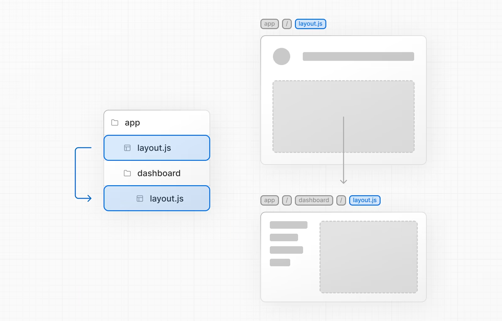
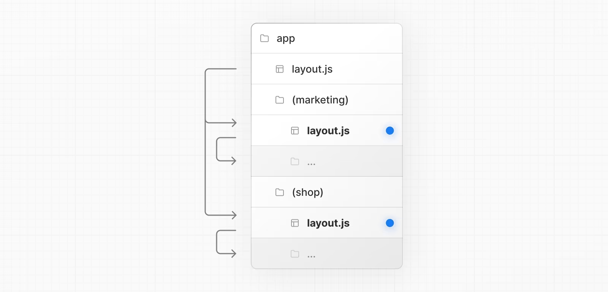

# Route
# 使用基于文件系统的路由，文件夹用于定义路由。
- page.js 和 layout.js
    - page.js 
        - 是路由的页面，使路由可以被访问。如果文件夹内没有 page.js，将不可当作路由被访问（可以放js，css，img 等或其他文件）。
    - layout.js 是
        - 布局文件，默认层级嵌套
        - 目录中根（顶层首个） layout 必须包含 html 和 body 标签
            
    - templates
    - Metadata
- []
    - 
- ()
    - Route Group，路由组，忽视这一级目录产生的路由路径。但这一级仍然可以添加 layout.js 进行页面布局
        
- (..)folderName

思考：
- 如何配置不按照目录结构的路由呢？